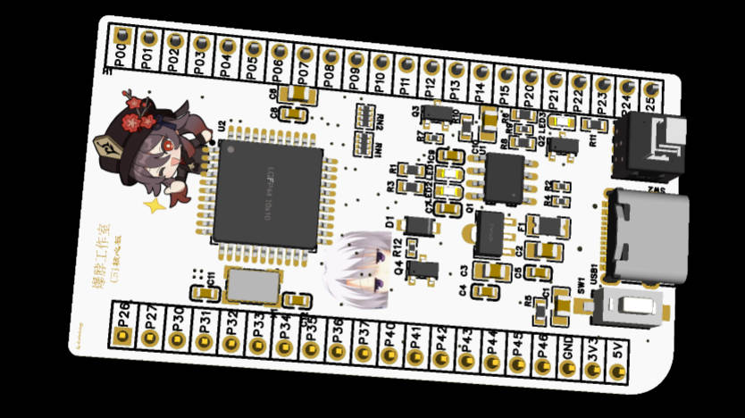
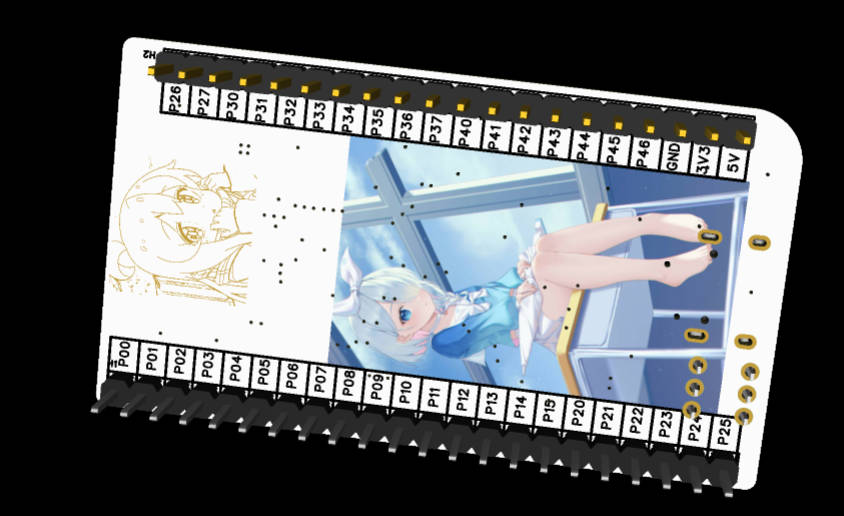

# P-C51core
C51 core board circuit design, this is atguigu's EDA course homework, you can use the C51 core board with all pins connected, including all modules such as program burning, cold start, power control, differential signal conversion, etc.

# Tutorial Videos

# File Directory Description

├─Hardware
│  ├─Release
│  │  ├─Gerber_PCB1_2025-03-11.zip       [Gerber file]
│  │  └─BOM_Board1_PCB1_2025-03-11.xlsx  [BOM file]
│  └─Source
│     └─ProPrj_2025-03-11.epro [Circuit design source files]
├─Image                        [Markdown image storage path]
└─PCB 3D Model
   └─3D_PCB1_2025-03-11.zip    [Circuit 3D model file]
(Please use [lc EDA](https://lceda.cn/) to open the source file)

# Color silk screen

The project source file supports color silk screen printing. Not using color silk screen printing will not affect the source file circuit.

# Function of each module

To be improved...